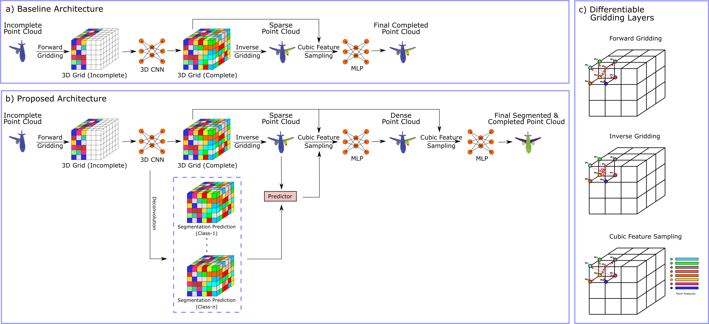

# Concurrent-Completion-and-Part-Segmentation-for-3D-Missing-Point-Clouds-viaSynergistic-Feature-Mapping

We are GroupPointCloud from CS484-555 (Bilkent University - Fall 2020). Here is a brief description of our project:

Scene understanding in 3D point clouds commonly requires part segmentation of the objects that aims to semantically cluster each point into multiple distinct regions manifesting the same characteristics. In this project, we proposed a novel architecture with joint use of 3D convolutional layers, multi-layer perceptron (MLP), and differentiable gridding layers for concurrent completion and part segmentation of partial 3D point cloud objects via synergistic feature aggregation from completion and segmentation branches. Comprehensive experiments performed on the ShapeNet-Part dataset clearly demonstrate that the proposed method effectively recovers complete point cloud objects and semantically segments their parts while maintaining equivalent performance to the gold-standard method directly performing completion from missing acquisitions. This study therefore holds a great promise to enhance practicality and utility of point clouds for 3D vision.

Group Members:
Yiğit Gürses 
Melisa Taşpınar 
Mahmut Yurt 

# Proposed Architecture

# Dataset

you can download the dataset by using:

bash download_shapenet_part16_catagories.sh

on the file 'download_shapenet_part16_catagories.sh' in the dataset folder. The dataset is the same with the one used in PFNet:
https://github.com/zztianzz/PF-Net-Point-Fractal-Network

alternative link: 链接：https://pan.baidu.com/s/1MavAO_GHa0a6BZh4Oaogug 提取码：3hoe 

# Installation and running

After downloading the dataset and installing all the packages in 'requirements.txt' you need to install the extensions for cuda by doing the following:

-cd to extensions folder, for each of 'chamfer_dist', 'cubic_feature_sampling', 'gridding', 'gridding_loss':
  -cd to that folder
  -run: python setup.py install --user
  
The extensions and the baseline architecture was taken from GRNet:
https://github.com/hzxie/GRNet

After you are done with the installations, you can cd to the project folder and run:
python runner.py

In order to change training modes and class categories, refer to 'train.py' in the folder 'core'.

